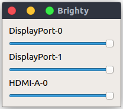

# Brighty

Primitive screen brightness tool, using python and xrandr, that allows to control individual monitor brightness.
The app itself is basically a GUI wrapper around xrandr.

## Thanks
https://github.com/Fushko/gammy for inspiration (Gammy works great, but does not let me control screens individually)

## Description

First, sorry for my python, this is probably very ugly and python is not my strongest language. Oh well :)

The app itself is very simple wrapper around XRANDR (which needs to be installed on the system). It will use it's output
to find connected screen outputs and create a brightness slider for each of them.

You can then unse sliders to change brightness of each screen, and the app will again use xrandr to update monitor
brightness.